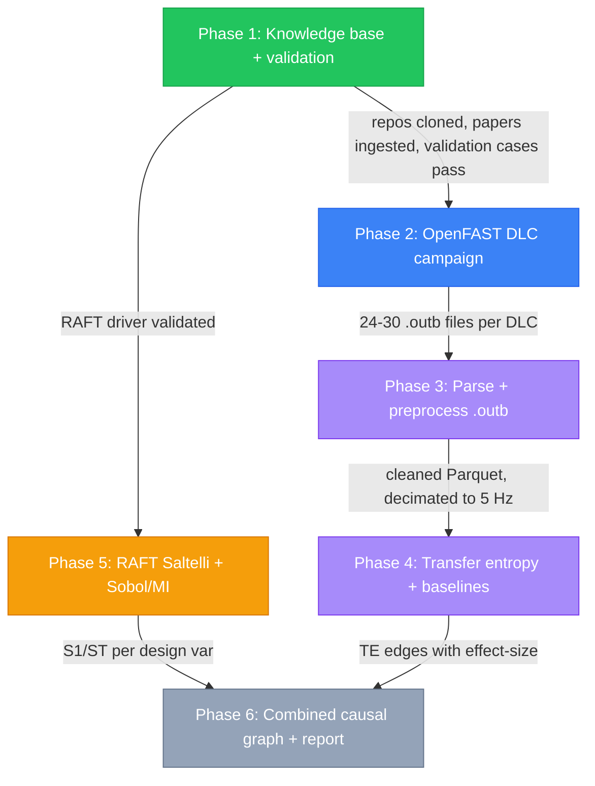
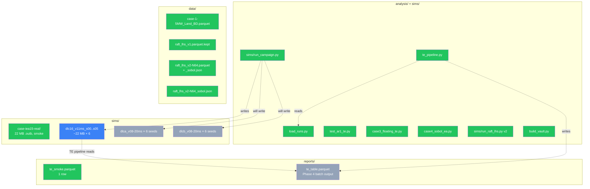
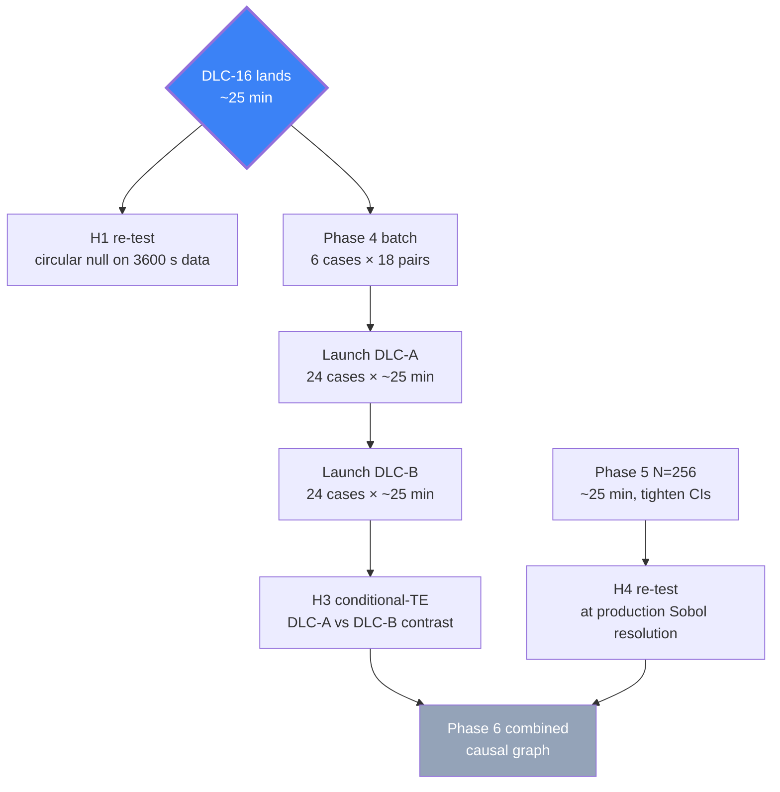

# Project flow dashboard

Visual state of the FOWT causal-effect-via-transfer-entropy project, last
refreshed **2026-05-15**. For the narrative log see [[log]]; for the locked
plan see [[PLAN]]; for unresolved decisions see [[open-questions]].

---

## TL;DR — where we are right now

> [!success] Phase 1 (knowledge base + validation) — **COMPLETE**
> All 4 validation cases pass; all Tier-1 methodology grounded; all 9 Q-decisions resolved or partially-resolved with execution deferred.

> [!info] Phase 2 (sim campaign) — **IN PROGRESS**
> DLC-16 production run launched 2026-05-15. 6 cases × V=11 m/s × TMax=3600 s on 6 cores. ETA ~25 min. Doubles as H1 re-test on PLAN-canonical data against the new circular-shift null.

> [!warning] Phase 5 (Sobol) first cut — **SMOKE-COMPLETE, N=64**
> 313/704 feasible. Headline: `L_u` (mooring length) is the dominant driver across 5/6 motion responses, beating `EA` (stiffness). H4 partially confirmed (right that mooring dominates; wrong about which mooring variable). Needs N≥256 for publication-grade indices.

> [!todo] Phase 4 TE pipeline — **CODE COMPLETE, AWAITING REAL DATA**
> `analysis/te_pipeline.py` written and smoke-tested. Will run on DLC-16 .outb files as they land.

---

## Top-level phase pipeline

**Legend**: 🟢 done · 🔵 running · 🟣 ready (code+gates clear) · 🟠 smoke-complete (needs production-size re-run) · ⚫ blocked

---

## Hybrid RAFT + OpenFAST architecture (locked 2026-05-13)

The methodological core. Mirrors [[sources/jeon-2025]]'s RAFT→OpenFAST split.

```mermaid
flowchart LR
    subgraph DESIGN[Design space]
        VARS[9 design variables<br/>±20% around IEA-15 baseline]
    end

    subgraph FAST_SCREEN[Phase 5 — fast screening]
        SALT[Saltelli sample<br/>N×D+2 designs]
        RAFT[RAFT frequency-domain<br/>~1 s per design]
        SOBOL[Sobol S1/ST<br/>+ KSG-MI]
        WINNERS[Top-Sobol/MI<br/>winners]
    end

    subgraph SLOW_VALID[Phase 4 + Phase 2 — time-domain]
        DLC[OpenFAST DLC matrix<br/>TMax=3600 s<br/>~25 min per case]
        PARSE[load_runs.py<br/>Parquet]
        TE[IDTxl pipeline<br/>BivariateTE / Conditional / AIS / Granger]
    end

    subgraph REPORT[Phase 6]
        GRAPH[Combined causal graph<br/>NetworkX, edge weight = TE_frac]
    end

    VARS --> SALT
    SALT --> RAFT
    RAFT --> SOBOL
    SOBOL --> WINNERS
    WINNERS --> DLC
    DLC --> PARSE
    PARSE --> TE
    TE --> GRAPH
    SOBOL --> GRAPH

    style RAFT fill:#f59e0b,color:#fff
    style DLC fill:#3b82f6,color:#fff
    style TE fill:#a78bfa,color:#fff
    style GRAPH fill:#94a3b8,color:#fff
```

**Why both**: RAFT can do 704 designs in 4 min; OpenFAST can't (would take 12 days). But RAFT gives only summary statistics — TE needs time series, which only OpenFAST provides. So RAFT picks the design winners; OpenFAST validates + supplies TE data on a small subset.

---

## Today's execution (2026-05-15)

```mermaid
gantt
    title 2026-05-15 work timeline (laid out by my completion order)
    dateFormat HH:mm
    axisFormat %H:%M

    section Morning
    Re-run case-3 TE on real .outb       :done, 10:45, 60m
    Move all sibling dirs into vault     :done, 11:48, 5m

    section Audits + cookbooks
    Agent 1 broad sanity                 :done, 12:00, 4m
    Agent 2 defensibility (4 axes)       :done, 12:00, 5m
    cookbook run-one-openfast-case       :done, 12:45, 15m
    cookbook build-saltelli-ensemble     :done, 13:00, 12m

    section Phase-2 prep
    IAAFT vs permute_in_time fix         :done, 13:15, 10m
    run_raft_lhs.py v2 (9 vars, parallel):done, 13:30, 25m
    run_campaign.py from single-case     :done, 14:00, 30m

    section Code review + fixes
    Agent 3 code-review v2 drivers       :done, 14:35, 4m
    JVM path bug fix                     :done, 14:42, 2m
    Editable installs re-registration    :done, 14:55, 5m
    AIS + max_shift bugs in te_pipeline  :done, 15:10, 10m

    section Production runs (parallel)
    Phase 5 RAFT N=64 (704 evals)        :done, 14:25, 4m
    te_pipeline smoke (1 pair)           :done, 15:00, 5m
    Phase 2 DLC-16 (6 cases × TMax=3600) :active, 15:30, 30m
```

---

## Hypothesis status matrix

H1-H6 are pre-registered (locked 2026-05-13 in [[open-questions]] Q8). No edits after Phase 2 launches.

| # | Hypothesis (short form) | Test gate | Status |
|---|---|---|---|
| **H1** | `TE(Wind1VelX → PtfmPitch)` significant in DLC-A and DLC-B; reverse direction ≈ 0 | [[validation/case-3-iea15-single-case-te]] | ⚠️ **CONTESTED.** Morning's smoke (random null) passed; afternoon smoke (circular null) failed. Re-testing on DLC-16 right now. |
| **H2** | `TE(Wave1Elev → PtfmHeave)` dominant in 0.1–0.3 Hz band; bivariate Granger + coherence agree | Phase 4 spectral break-down | ⏸️ Awaiting DLC-16 |
| **H3** | Conditional TE shrinks vs bivariate by < 80 % in DLC-A but ≈ bivariate in DLC-B | DLC-A vs DLC-B contrast | ⏸️ Awaiting DLC-A and DLC-B |
| **H4** | `ST(EA \| surge_std) > 0.5` AND `ST(L_u \| surge_std) > 0.2`; ΣST(geometry) < 0.3 | RAFT Saltelli | 🟡 **PARTIAL.** L_u ✓ (0.82±0.44); EA ✗ (0.09 ± 0.08); geometry ✗ (sum=1.31, also > 1 = noisy). Re-test at N=256. |
| **H5** | Fairlead-tension trade-off explained by mooring sizing + wave drive (Q9 lead) | Phase 5 (Sobol) + Phase 4 (cond TE) | ⏸️ Awaiting both halves |
| **H6** | `TE(wave → PtfmPitch)` local-PSD peaks at pitch eigenfreq ~0.035 Hz | Phase 4 spectral break-down | ⏸️ Awaiting DLC-A |

---

## Code + data inventory

---

## What blocks what (after DLC-16 lands)

---

## Known caveats (don't gloss over these in the paper)

1. **H1 stronger-null regression**: morning result was tested against IDTxl's weakest null (`perm_type='random'`). After reconciliation to `perm_type='circular'` (spectrum-preserving) the same signal does not pass. Real H1 status TBD by DLC-16.
2. **Phase 5 numerical instability at N=64**: several ST indices > 1.0 (theoretical max). Ranking is informative; magnitudes need N≥256 to be publication-quality.
3. **Phase 5 divergence guard incomplete**: catches unphysical surge/sway/heave but misses pitch/roll/yaw. `pitch_avg` in N=64 has range [-3e6°, +4e6°] — corrupted.
4. **DLC_WAVES table is approximate** (north-Atlantic generic); replace with site-specific lookup before publication.
5. **TurbSim seeds and HydroDyn waves** are independently controllable per case but the (Hs, Tp) joint distribution with wind is approximated, not derived from IEC 61400-3.

---

## Related

- [[index]] · [[overview]] · [[log]] · [[PLAN]] · [[SCHEMA]] · [[open-questions]]
- Cookbook: [[cookbook/run-one-openfast-case]] · [[cookbook/build-saltelli-ensemble]]
- Validation: [[validation/case-1-r-test-parse]] · [[validation/case-2-ar1-te-recovery]] · [[validation/case-3-iea15-single-case-te]] · [[validation/case-4-sobol-3pt-mooring-ea]]
