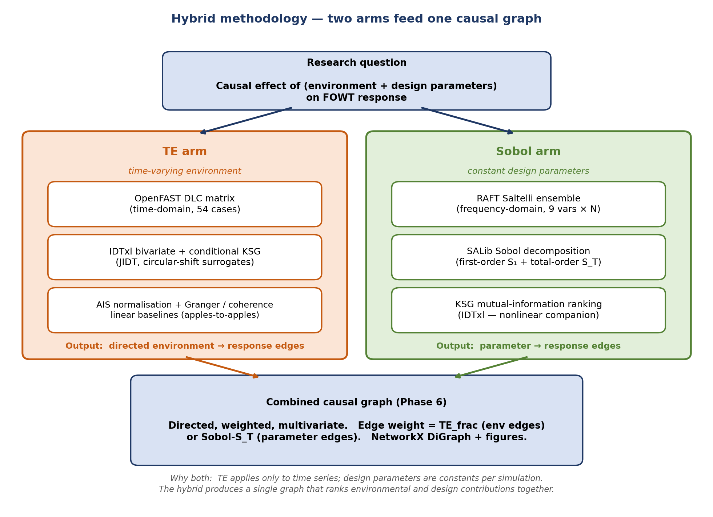
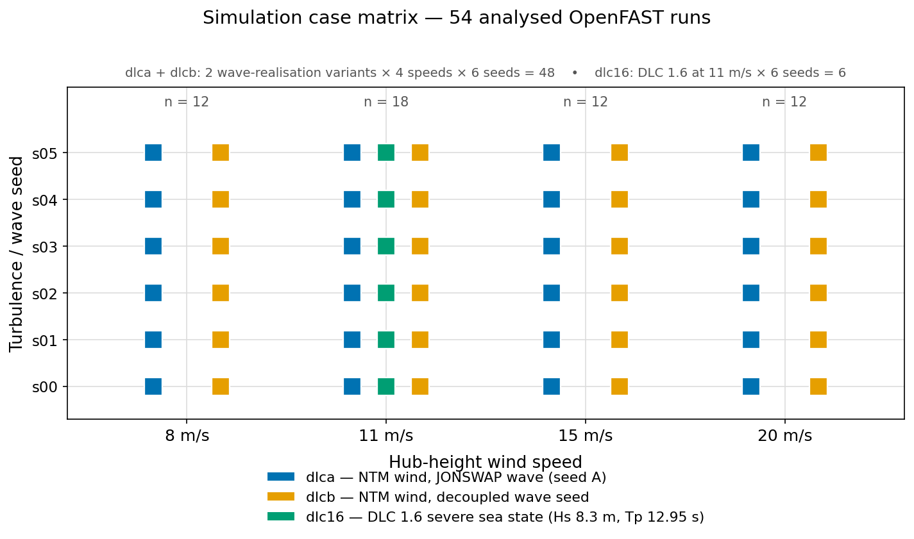
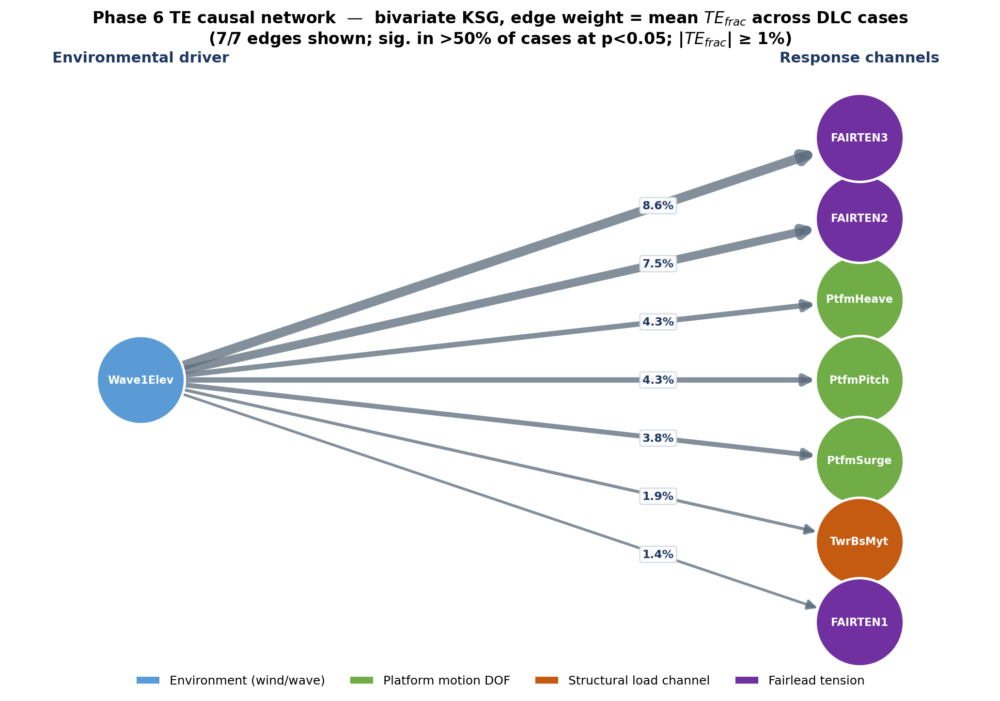
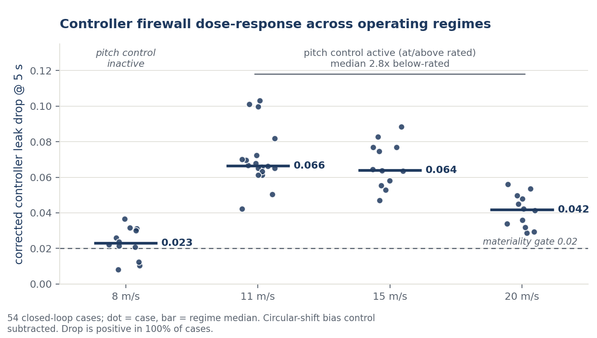
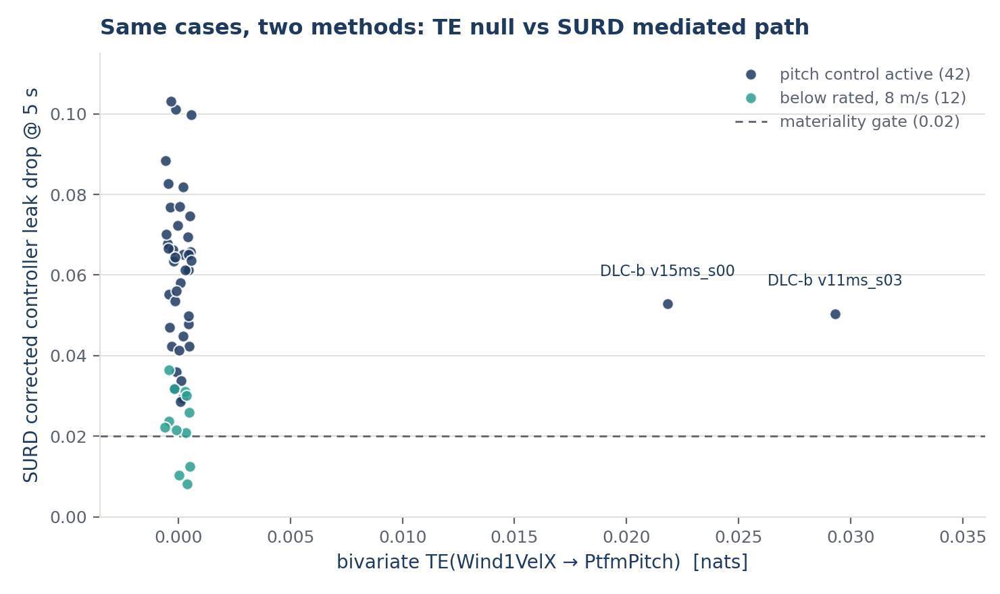
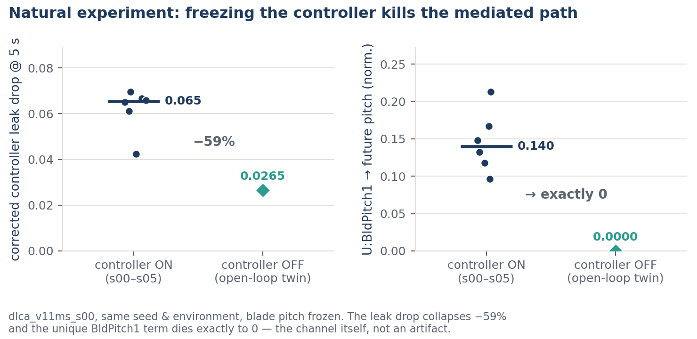
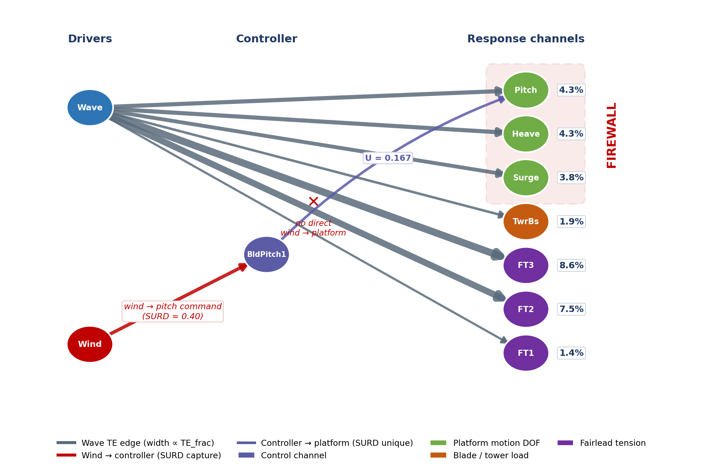
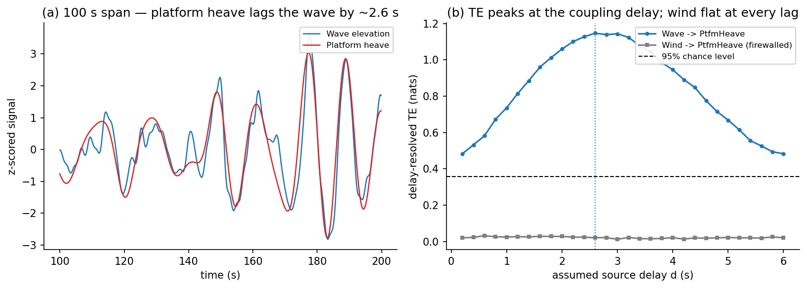
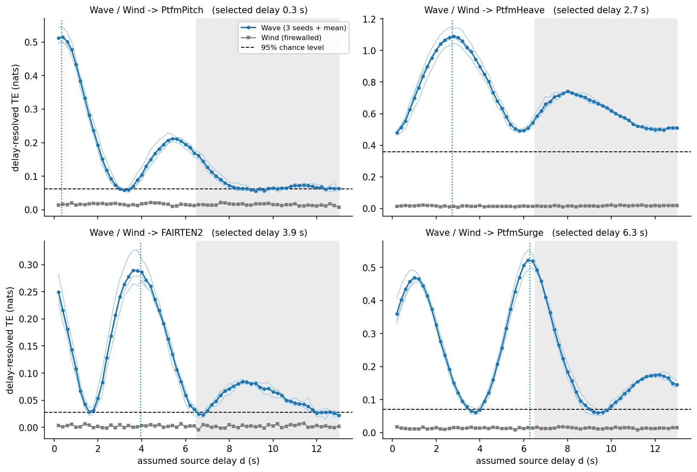

## Abstract

Structural health monitoring of floating offshore wind turbines (FOWTs) largely inherits fixed-bottom methods that measure statistical association, not the *direction* of influence, and reveal nothing about whether the controller works. In a healthy FOWT the blade-pitch controller is shown to act as an information *firewall*, regulating rotor thrust so effectively that turbulent wind transfers essentially no information into platform motion. Using model-free transfer entropy (TE) with the Kraskov–Stögbauer–Grassberger estimator on 54 OpenFAST simulations of the IEA-15MW on VolturnUS-S, TE(Wind → platform pitch) averages 0.0009 nats (maximum 0.029; significant in 3.7% of cases) against 0.121 nats for wave forcing (100% significant); wind is selected as a significant source less often than chance — the firewall is total within the test's resolution. Linear coherence reports a strong apparent link (γ² ≈ 0.72) — shared spectral power, not causation — so the undirected tool misses the firewall; delay-resolved analysis confirms it is no lag artefact. The firewall is attributed to the controller, not wave dominance: SURD locates the wind information in the blade-pitch command, and an open-loop twin shows that influence collapsing once the loop opens. The firewall suggests a diagnostic: a fault degrading thrust regulation should re-admit wind information into the structure. This is framed as a motivated outlook, not a method — the dataset contains no computed fault-case TE — and the graded-fault validation required is specified. To the authors' knowledge, this is the first use of directed information flow to show how control shapes disturbance propagation into a floating turbine's structure.

**Keywords:** floating offshore wind turbine; transfer entropy; structural health monitoring; blade-pitch control; information theory; fault detection

---

## 1. Introduction

Floating offshore wind is moving from demonstration to commercial scale, and with that shift comes a monitoring problem that fixed-bottom experience does not fully cover. A floating platform couples the rotor, tower, and mooring system into a single lightly damped dynamic body whose low-frequency rigid-body modes sit near the wave-energy band. The blade-pitch controller, designed to regulate rotor speed and power above rated wind speed, becomes a first-order driver of platform motion because every pitch action changes rotor thrust and therefore the overturning moment on the floater. A controller that is healthy stabilises the platform; a controller that is degraded can excite it. Detecting that degradation early, from ordinary operational signals, is the problem this paper addresses.

Condition monitoring of wind turbines is a mature field, but its dominant tools were built to find *component* faults — bearing wear, gearbox spalling, generator insulation — through vibration analysis and SCADA trending (Tautz-Weinert & Watson, 2017). Pitch-system faults are among the most frequent and costly failure modes in offshore fleets (Carroll et al., 2016), yet they are awkward for component-level methods: a pitch fault does not announce itself as a single vibration line, it manifests as a change in how the whole machine *responds* to its environment. What is missing is a diagnostic that watches the closed loop itself — that asks whether the controller is still severing the path from disturbance to structure the way it should.

The methods most commonly used to relate environmental forcing to structural response — power spectral density, magnitude-squared coherence, and variance-based sensitivity analysis such as Sobol indices — share two limitations for this task. First, they are undirected or assume a fixed input→output map: coherence indicates only that wind and platform pitch share power at a frequency, not which drives which, and Sobol indices apportion output variance to inputs under a static functional model that a feedback loop violates. Second, and more importantly, none of them is designed to detect the *absence* of a pathway that a controller has deliberately created, or to exploit that absence as a health signal.

Transfer entropy (Schreiber, 2000) offers exactly this. TE measures the reduction in uncertainty about the future of a target signal gained from the past of a source signal, beyond what the target's own past already provides. It is directed, model-free, and sensitive to nonlinear coupling, which matters because a saturating, gain-scheduled pitch controller is strongly nonlinear. The central empirical observation of this study is that in a healthy FOWT the blade-pitch controller drives the transfer entropy from wind to platform motion to essentially zero — not because wind is unimportant, but because the controller consumes the wind information before it can reach the structure. This is called the *information firewall*.

This paper makes two contributions and develops a motivated outlook:

1. **A control-induced information firewall in a FOWT is identified and quantified.** Across 54 simulations spanning four wind speeds, TE from hub-height wind to platform pitch is statistically indistinguishable from zero (mean 0.0009 nats, significant in 3.7% of cases), whereas TE from wave elevation to the same response is large and universally significant (mean 0.121 nats, 100%). Linear coherence is shown to report a strong apparent wind–platform link — shared spectral power that reads as influence — where TE certifies none, illustrating concretely why directed, nonlinear methods are needed in a closed loop.

2. **The firewall is attributed to the controller, not to wave dominance.** Using the SURD decomposition (Martínez-Sánchez et al., 2024), the wind information is shown to be redirected into the blade-pitch command, and using an open-loop twin — in which the pitch command's unique influence on platform motion collapses once the loop is opened — the barrier is shown to be a property of active control rather than a generic feature of the platform.

The two contributions above are demonstrated results. Beyond them, the firewall's **implication for health monitoring** is developed as an outlook: because a healthy controller holds wind→structure information at a near-zero, tightly bounded baseline, a fault that degrades thrust regulation should re-admit wind information into the structure, giving a model-free diagnostic. This is explicitly a hypothesis rather than a demonstrated method — the present dataset contains no computed fault-case transfer entropy — and the graded-fault campaign required to test it is specified (Section 5.3).

The scope is deliberately narrow: a single turbine (IEA-15MW) on a single platform (VolturnUS-S), simulated in OpenFAST at four wind speeds under the IEC normal turbulence model with wind-speed-matched sea states, plus a severe-sea-state DLC 1.6 set near rated. The claims made here are correspondingly bounded, and Section 5 states them as such. What the study establishes is a mechanism and its attribution; what it does not establish is a validated fault-detection method, a boundary made explicit throughout.

The remainder of the paper is organised as follows. Section 2 reviews FOWT health monitoring, blade-pitch control, and information-theoretic causality, and states the gap precisely. Section 3 describes the simulation model, the TE and SURD estimators, and the monitoring-signature construction. Section 4 presents the firewall, the coherence contrast, the attribution evidence, and the monitoring hypothesis. Section 5 discusses physical interpretation, the monitoring outlook, and limitations. Section 6 concludes.

---

## 2. Background and Related Work

### 2.1 Structural health monitoring and fault detection for offshore wind turbines

Condition monitoring for wind turbines is well developed for drivetrain and structural components. Vibration-based methods track bearing and gearbox signatures; SCADA-based methods trend temperatures, power curves, and control set-points to flag anomalies (Tautz-Weinert & Watson, 2017). Reliability studies of offshore fleets consistently rank the pitch and control subsystems among the largest contributors to failure rate and downtime (Carroll et al., 2016), which makes pitch-system diagnostics a high-value target. Pitch faults have been addressed with SCADA-driven prognosis (Chen et al., 2015), physics-based residual models, and data-driven classifiers, but these approaches generally monitor pitch *actuator* variables directly (position error, motor current, hydraulic pressure) rather than the *effect* of pitch control on the rest of the machine.

A parallel strand of structural monitoring works on the load-carrying structure itself rather than on components, using vibration-based and operational modal analysis (OMA) methods to track shifts in natural frequencies, mode shapes, and damping as indicators of damage. These methods are powerful for detecting stiffness loss but are built around the assumption that the structure is a passive dynamical system whose modal properties change only when it is damaged. A wind turbine violates that assumption: its apparent dynamics are shaped continuously by the controller, so an OMA feature can move because the control gains scheduled to a new operating point, not because anything is wrong. Separating control-induced from damage-induced changes in a closed-loop, time-varying system is a recognised difficulty, and it is one reason component-level and modal methods do not naturally answer the question posed here — whether the control loop itself is still doing its job.

For floating turbines the monitoring problem changes character. The platform's rigid-body modes are lightly damped and sit close to the wave-frequency band, so the structural response to environment and control is more strongly coupled than on a monopile. A pitch fault does not merely degrade power capture; it changes the thrust forcing on a floating body and can amplify platform motion, mooring tension, and tower base loads. This argues for a monitoring quantity defined on the *system response* — how the machine's structural signals relate to its environment — rather than on any single component. That is the quantity developed here.

### 2.2 Blade-pitch control of large floating wind turbines

Above rated wind speed, utility-scale turbines regulate rotor speed with collective blade pitch. Reference controllers such as ROSCO (Abbas et al., 2022) implement gain-scheduled proportional–integral pitch control, and for floating platforms they add loops (for example, set-point smoothing and floating feedback terms) specifically to avoid the negative-damping instability in which pitch-to-feather action feeds platform pitch motion (Larsen & Hanson, 2007). The control objective, stated informally, is to hold rotor thrust roughly constant against wind fluctuations. Constant thrust means the platform sees a smoothed forcing: the turbulent, broadband wind excitation is converted by the controller into a comparatively featureless thrust, while the pitch command carries the fluctuating part.

This is the physical seed of the firewall. If the controller perfectly regulated thrust, wind fluctuations would be invisible to the platform, and any information-flow measure from wind to platform would vanish. Real controllers are imperfect and gain-scheduled, so the firewall is strong but not absolute, and its strength depends on operating region — points quantified in Section 4. Bossanyi (2000) established the closed-loop design principles that make this regulation possible; the present contribution is to observe its *information-theoretic* fingerprint and to use that fingerprint diagnostically.

### 2.3 Transfer entropy and information-theoretic causality

Transfer entropy (Schreiber, 2000) quantifies directed, model-free coupling between time series. It generalises Shannon's information theory from a static, symmetric measure of shared uncertainty into a directed, dynamic one, and the shortest route to it is to build it up from the classical quantities (Chen et al., 2019). The starting point is the Shannon entropy of a random variable $X$, the average uncertainty of its outcomes,

$$
H(X) = -\sum p(x)\, \log p(x),
$$

and the mutual information between two variables, the reduction in uncertainty about one that knowing the other provides,

$$
I(X; Y) = \sum p(x, y)\, \log \frac{p(x, y)}{p(x)\, p(y)} = H(X) + H(Y) - H(X, Y).
$$

Mutual information measures *how much* two signals share, but it is symmetric — $I(X; Y) = I(Y; X)$ — and carries no notion of time, so it cannot say whether $X$ drives $Y$ or the reverse (Chen et al., 2019). Introducing dynamics, the entropy rate of $X$ is the uncertainty that remains in its next sample once the process's own recent past is known,

$$
h_X = -\sum p\!\left(x_{t+1}, x_t^{(k)}\right)\, \log p\!\left(x_{t+1} \mid x_t^{(k)}\right),
$$

where $x_t^{(k)} = \left(x_t, x_{t-1}, \dots, x_{t-k+1}\right)$ is the delay-embedded history of a Markov process of order $k$. Transfer entropy then asks how much of that residual uncertainty is removed by *also* conditioning on the past of a second signal $Y$: for a target $X$ and source $Y$ it is the mutual information between the target's future and the source's past, conditioned on the target's own past,

$$
T_{Y \to X} = \sum p\!\left(x_{t+1}, x_t^{(k)}, y_t^{(l)}\right)\, \log \frac{p\!\left(x_{t+1} \mid x_t^{(k)}, y_t^{(l)}\right)}{p\!\left(x_{t+1} \mid x_t^{(k)}\right)},
$$

where $x_t^{(k)}$ and $y_t^{(l)}$ are delay-embedded histories of Markov orders $k$ and $l$. Equivalently, transfer entropy is the amount by which knowing the source's history lowers the target's entropy rate,

$$
T_{Y \to X} = h_X - h_{X \mid Y},
$$

with $h_{X \mid Y}$ the entropy rate of $X$ conditioned on the joint past of $X$ and $Y$ (Chen et al., 2019). Written this way the measure has a direct diagnostic reading: it strips out the target's own memory and any influence common to both channels, retaining only the information that the history of $Y$ contributes to the future of $X$. If the source leaves the target's transition probabilities unchanged the two entropy rates coincide and $T_{Y \to X} = 0$; and because the conditioning is one-sided, $T_{Y \to X} \neq T_{X \to Y}$ in general, so transfer entropy resolves the direction of coupling that mutual information cannot. The definitions above are written for discrete outcomes, but the quantities are estimator-agnostic; for the continuous FOWT signals analysed here they are evaluated in nats with the nearest-neighbour KSG estimator described in Section 3.3, which avoids the binning that a discrete or kernel-density estimate of these probabilities would require. Here a nat is the unit of information obtained when entropy is defined with the natural logarithm rather than $\log_2$ — the form the digamma-based KSG estimator returns natively — so that observing an event of probability $1/e$ conveys one nat, equal to $1/\ln 2 \approx 1.443$ bits (equivalently $1\ \text{bit} = \ln 2 \approx 0.693$ nats). TE reduces to Granger causality for jointly Gaussian processes (Barnett et al., 2009), but retains sensitivity to the nonlinear, non-Gaussian coupling that a saturating controller produces, which is why it is preferred here to linear coherence or Granger tests.

Estimating TE from continuous signals without binning is done efficiently with the Kraskov–Stögbauer–Grassberger (KSG) nearest-neighbour estimator (Kraskov et al., 2004), implemented for conditional mutual information in JIDT (Lizier, 2014) and orchestrated with automatic embedding selection and non-parametric significance testing in IDTxl (Wollstadt et al., 2019). Transfer entropy has become a standard tool for data-driven causal discovery across fields where a governing model is unavailable or untrustworthy — neural connectivity, climate teleconnections, financial contagion — precisely because it makes no linearity or functional-form assumption and needs only the observed time series. In engineering it has been used to locate the source and direction of disturbance propagation in industrial process-control loops (Bauer et al., 2007), a setting closely analogous to the present one: a controlled plant in which one wants to know which upstream variable is driving a downstream fluctuation, and where the answer is used to diagnose loop performance. The nearest-neighbour KSG estimator is the pragmatic choice for continuous signals such as these because it avoids the bias and bin-width sensitivity of histogram estimators and adapts to the local density of the data, at the cost of a tuning parameter (the neighbour count $k$) whose influence is addressed in the limitations. What has not been done, to the authors' knowledge, is to turn this directed-information machinery on the *control loop itself* in a floating wind turbine — to treat the controller's suppression of an information pathway as the observable of interest, and its failure to suppress as a fault signal.

A limitation of pairwise TE is that it cannot separate redundant, unique, and synergistic contributions when several sources jointly drive a target. The SURD framework (Martínez-Sánchez et al., 2024) decomposes the information that a set of sources provides about a target's future into synergistic, unique, and redundant components plus an unaccounted "leak" term. SURD is used not as the primary metric but as an attribution tool: it allows asking whether the wind information that never reaches the platform is instead being captured by the blade-pitch command.

### 2.4 Synthesis and gap statement

Three threads converge. Health monitoring needs a quantity that reflects whether the closed loop is functioning, not just whether a component is worn. Floating-turbine control deliberately severs the path from wind to platform, creating an observable absence of coupling. Transfer entropy can measure that absence, directionally and without a model, where coherence and Sobol indices cannot. The gap is that no existing method uses the *controller-induced absence of information flow* as a health signal. Association-based and variance-based tools cannot see a severed pathway, and they certainly cannot tell when it has been un-severed by a fault. This paper closes that gap: it establishes the firewall, attributes it to the controller, and proposes its breach as a diagnostic.

---

## 3. Methods

Figure 1 summarises the analysis pipeline: OpenFAST simulation, signal conditioning, parallel TE / coherence / SURD estimation, and construction of the monitoring signature.

**Figure 1.** Methodology overview. Three analysis arms — directed transfer entropy, a linear coherence baseline, and SURD attribution — operate on the same conditioned OpenFAST signals and feed the monitoring-signature construction.

### 3.1 Turbine model and simulation campaign

The plant is the IEA Wind 15-MW reference turbine (Gaertner et al., 2020) mounted on the UMaine VolturnUS-S reference semisubmersible (Allen et al., 2020), simulated in OpenFAST (NREL, n.d.) with the ROSCO reference controller (Abbas et al., 2022). The controller (ROSCO 2.10.1) runs with its floating-specific feedback active (`Fl_Mode = 2`, nacelle-pitching-velocity feedback, gain $-9.2$ s) and set-point smoothing enabled (`SS_Mode = 1`) — the loops that suppress the pitch-to-platform coupling on which the firewall depends, so the firewall is a property of a controller configured as a floating controller should be, not of an unaugmented land-based tuning. Platform hydrodynamics use potential-flow loading with full difference-frequency second-order (QTF) wave forces (HydroDyn `PotMod = 1`, `DiffQTF = 12`, `SumQTF = 0`), so the sub-wave-frequency drift excitation of the lightly damped platform-pitch mode — the mechanism behind the dominant wave→platform coupling reported below — is represented by the model rather than assumed. Aero-hydro-servo-elastic coupling captures the interaction of turbulent wind, irregular waves, blade-pitch control, and platform and mooring dynamics.

The campaign spans four hub-height wind speeds from below-rated to well-above-rated operation — 8, 11, 15, and 20 m/s — under the IEC normal turbulence model. Each wind speed is repeated over six turbulence/wave seeds in two wave-realisation variants — in the first the wave seed is tied to the wind seed (paired realisations), in the second it is decoupled by a fixed bit-mask, so the variants share identical wind fields but statistically independent wave realisations (48 simulations); to these is added a design-load-case 1.6 severe-sea-state set (significant wave height 8.3 m, peak period 12.95 s) at 11 m/s over six seeds (6 simulations), for 54 analysed simulations in total. Figure 2 shows the case matrix. Turbulent wind fields are generated per IEC 61400 conventions. Irregular waves use a JONSWAP spectrum whose parameters are matched to the nominal wind speed, approximating joint wind–wave statistics for North-Atlantic wind seas: significant wave height and peak period (Hs, Tp) = (3.5 m, 9.0 s), (4.5 m, 10.0 s), (6.0 m, 11.0 s), and (8.0 m, 13.0 s) at 8, 11, 15, and 20 m/s respectively, with the DLC 1.6 set at (8.3 m, 12.95 s). The resulting wave spectral peaks (0.077–0.111 Hz) are well separated from the platform-pitch eigenfrequency at 0.0345 Hz, so wave- and platform-driven contributions can be resolved. Wind and waves are co-directional in all cases; wind–wave misalignment and directional spreading, which would redistribute platform pitch and roll and alter the wave→platform coupling that defines the baseline here, are outside the present scope. The semisubmersible is held by a three-line catenary mooring, and the three fairlead tensions are analysed as separate targets so that the propagation of forcing into the mooring system is visible rather than aggregated. Each run is analysed over a 15,001-sample window (≈ 50 min at the 5 Hz analysis rate) after removal of the initial start-up transient, long enough to contain many cycles of the slowest platform mode and to support stable nearest-neighbour density estimates. Each simulation provides synchronized time series of the environmental drivers (hub-height wind speed `Wind1VelX`, wave elevation `Wave1Elev`), the platform response (`PtfmSurge`, `PtfmHeave`, `PtfmPitch`), fairlead mooring tensions (`FAIRTEN1`–`FAIRTEN3`), blade-root moments (`RootMxc1`, `RootMyc1`), tower-base fore-aft moment (`TwrBsMyt`), and the control/intermediate variables blade pitch (`BldPitch1`) and rotor thrust (`RotThrust`). Table 1 defines each monitored channel with its physical quantity, units, and role in the analysis.

**Table 1.** Monitored OpenFAST output channels — the environmental drivers, platform and structural responses, and control/intermediate signals used throughout the analysis — with their physical quantity, units, and role. Units are as written by the simulation output (fairlead tensions in N, moments in kN·m).

| Channel | Physical quantity | Units | Role |
|---|---|---|---|
| `Wind1VelX` | Hub-height longitudinal wind speed | m/s | Environmental driver (source) |
| `Wave1Elev` | Wave elevation at the platform reference point | m | Environmental driver (source) |
| `PtfmSurge` | Platform surge displacement | m | Platform response (target) |
| `PtfmHeave` | Platform heave displacement | m | Platform response (target) |
| `PtfmPitch` | Platform pitch rotation | deg | Platform response (target) |
| `FAIRTEN1` | Fairlead tension, up-wave mooring line | N | Mooring response (target) |
| `FAIRTEN2` | Fairlead tension, down-wave mooring line | N | Mooring response (target) |
| `FAIRTEN3` | Fairlead tension, down-wave mooring line | N | Mooring response (target) |
| `RootMxc1` | Blade-1 root edgewise (in-plane) moment | kN·m | Structural response (target) |
| `RootMyc1` | Blade-1 root flapwise (out-of-plane) moment | kN·m | Structural response (target) |
| `TwrBsMyt` | Tower-base fore-aft (pitching) moment | kN·m | Structural response (target) |
| `BldPitch1` | Blade-1 collective pitch angle | deg | Control / intermediate |
| `RotThrust` | Rotor thrust | kN | Control / intermediate |

**Figure 2.** Simulation case matrix. Four wind speeds (8, 11, 15, 20 m/s) over six turbulence/wave seeds in two wave-realisation variants (48 runs), plus a DLC 1.6 severe-sea-state set at 11 m/s over six seeds (6 runs) — 54 analysed runs, below-rated through above-rated.

### 3.2 Signal conditioning

All signals are decimated to a common 5 Hz analysis rate (`decimate_target_hz = 5.0`). This band comfortably resolves the dynamics of interest: the VolturnUS-S platform-pitch eigenfrequency is ≈ 0.0345 Hz (period ≈ 29 s) and the wave-energy peaks sit at 0.077–0.111 Hz across the modelled sea states, both far below the Nyquist limit at 5 Hz. A small amplitude jitter (scale $10^{-10}$) is added to break degenerate ties for the nearest-neighbour estimator, following Kraskov et al. (2004, §III.A). Analysis windows contain 15,001 samples (≈ 50 min) per run.

### 3.3 Transfer-entropy estimation

Transfer entropy is estimated with IDTxl's `BivariateTE` using the KSG conditional-mutual-information backend (`JidtKraskovCMI`) with $k = 4$ nearest neighbours (Kraskov et al., 2004; Lizier, 2014; Wollstadt et al., 2019). IDTxl performs greedy, statistically guided selection of source and target history variables rather than fixing an embedding a priori.

The choice of a $k$-nearest-neighbour estimator over a kernel-density one is deliberate, because estimating transfer entropy is ultimately estimating the joint and marginal probability distributions of the embedded source, target, and conditioning variables, and the two standard estimator families — kernel-density and $k$-nearest-neighbour — handle those distributions differently. The KSG estimator (Kraskov et al., 2004), built on the Kozachenko–Leonenko entropy estimator (Kozachenko & Leonenko, 1987) and its conditional extension (Frenzel & Pompe, 2007), is distribution-free and locally adaptive: it infers density from nearest-neighbour distances rather than assuming a parametric form or requiring a bandwidth or bin width to be tuned. Two features of the present problem make this preferable to a kernel-density estimator. First, the FOWT signals are non-Gaussian — the controller saturates and gain-schedules — so an estimator that reduces to Granger causality only in the Gaussian limit (Barnett et al., 2009) avoids imposing a distributional form on the very couplings under test. Second, the analysis is multivariate — conditional TE and the six-variable SURD decomposition of Section 3.6 — and kernel-density estimators degrade rapidly with dimension, whereas the KSG family remains comparatively well-behaved and has been shown to outperform kernel methods on short, noisy records (Khan et al., 2007). The estimator's one substantive requirement, continuous variables without repeated values, is met by the $10^{-10}$ amplitude jitter of Section 3.2 (Kraskov et al., 2004, §III.A), which keeps neighbour counts well-defined on channels that can dwell at a bound such as a saturated or locked pitch actuator. The neighbour count $k = 4$ follows the Kraskov et al. (2004) recommendation; the reported conclusions were confirmed not to be an artefact of it. Sweeping $k \in \{3, 4, 6, 8\}$ on the wave→platform-heave and wind→platform-heave delay profiles leaves the selected coupling delay unchanged (2.7–2.9 s) and the wind→platform firewall intact — the wind ceiling stays $\le 0.03$ nats and the wave-to-wind peak ratio stays in the range 39–48× at every $k$. The absolute transfer entropy scales mildly with $k$, as expected for a nearest-neighbour estimator, but no result in this paper depends on that magnitude.

The target self-embedding searches lags up to `max_lag = 150` samples (30 s at 5 Hz), long enough to capture the slow platform-pitch self-dynamics (~29 s period). The source-candidate window is decoupled and short (`max_lag_sources = 30`, i.e. 6 s), reflecting that environmental coupling to the platform acts at short lag while the target's own memory is long; decoupling the two windows keeps the greedy source search both sensitive and computationally tractable. The candidate-lag spacing is `tau = 1` (every lag considered) by default. For the slowest-drifting targets (`PtfmPitch`, `PtfmHeave`, and related channels) a per-target thinning `tau = 5` is used where the dense tau = 1 search over 150 candidate lags is computationally prohibitive; this preserves the 30 s window while reducing the candidate grid. All hyperparameters are reported here without modification.

Fault-detection applications of transfer entropy typically identify four quantities to optimise for the problem at hand: the sampling rate, the analysis-window width, and the source and target history (Markov) orders of the process (Chen et al., 2019). Three map directly onto the settings above and one differs in kind. The sampling rate is fixed at 5 Hz (Section 3.2) and the analysis window is the full ~50-min post-transient record per run. The two history orders, however, are *not* fixed by hand: IDTxl's greedy, statistically gated embedding selects them per channel pair from the data, within the search bounds given above — target history up to 150 samples (30 s) and source candidates up to 30 samples (6 s), at candidate spacing `tau = 1` (`tau = 5` for the slow-drift targets). Choosing the history orders from the data rather than pre-setting them removes the sensitivity to a hand-tuned embedding order that a fixed-order estimator carries, at the cost of the greedy search that these bounds and the `tau` thinning keep tractable.

Because bivariate transfer entropy conditions only on the target's own past, a statistical dependence between the two environmental drivers could in principle confound the wind→ and wave→structure estimates. This was verified not to occur. Hub-height wind (`Wind1VelX`) and wave elevation (`Wave1Elev`) are prescribed from independent TurbSim and JONSWAP realisations and are statistically independent within each run: across the analysed runs the lag-0 Pearson correlation is $|r| \le 0.035$ and the cross-correlation does not exceed $0.043$ at any lag within $\pm 30$ s, while the mutual information ($0.033$–$0.043$ nats) is statistically indistinguishable from an autocorrelation-preserving circular-shift surrogate (no case reaches $p < 0.05$) — that is, it sits at the estimator's finite-sample bias floor. Conditional and bivariate transfer entropy therefore coincide for these sources, and the reported bivariate estimates are not inflated by driver correlation. The complementary concern of *synergistic* wind information invisible to any pairwise estimator is addressed separately by the SURD decomposition (Section 3.6), whose synergistic atom would expose exactly that.

### 3.4 Effect size and significance

Raw TE in nats is difficult to compare across channels with different intrinsic predictability. A normalised effect size `te_frac = TE / AIS` is therefore reported alongside TE, where AIS is the active information storage of the target,

$$
A_X = \sum p\!\left(x_{t+1}, x_t^{(k)}\right)\, \log \frac{p\!\left(x_{t+1} \mid x_t^{(k)}\right)}{p\!\left(x_{t+1}\right)} = I\!\left(x_{t+1}; x_t^{(k)}\right),
$$

the mutual information between the target's future and its own embedded past (Lizier, 2014), estimated with the same KSG backend (IDTxl `ActiveInformationStorage`). AIS measures how much of the target's future is already explained by its own history; dividing TE by AIS therefore expresses the source's contribution as a fraction of the target's self-predictability, so a `te_frac` of 0.10 means the source adds ten per cent on top of what the target's own past already provides. This normalisation matters for the firewall claim: a channel can have small absolute TE simply because the target is highly self-predictable, and `te_frac` guards against reading such a case as a genuine absence of coupling.

Statistical significance uses a non-parametric permutation test. IDTxl builds a null distribution for each candidate source by repeatedly shuffling the source realisations while preserving the target's own history, re-estimating the (conditional) mutual information under the null, and comparing the observed statistic to that distribution (`n_perm = 200` surrogates, $\alpha = 0.05$). Two corrections make the test conservative: a maximum-statistic correction across candidate source lags controls the family-wise error introduced by the greedy search, and an omnibus test gates whether the target has any significant sources at all. A source variable is admitted to the model only if it survives these tests, so a non-significant channel returns TE = 0 exactly — no source variable is selected — rather than a small positive value. That exact zero is the numerical signature of the firewall, and it is why the wind→platform channel reports 0.0000 nats in the 8 m/s and 20 m/s regimes rather than a small residual. The channel means reported in Tables 2–4 apply this convention — non-significant cases contribute exactly zero — so that a reported mean averages only the significant edges and is never negative, even though the underlying nearest-neighbour estimates of individual non-significant cases can take small signed values.

### 3.5 Coherence baseline

As a linear-method foil, the magnitude-squared coherence $\gamma^2(f)$ between each source and target is computed by Welch's method (segment length 4096 at 5 Hz, giving $\Delta f \approx 0.0012$ Hz, sharp enough to separate the platform-pitch eigenfrequency at 0.0345 Hz from the wave peak). The 15,001-sample records give six 50%-overlapping Welch segments per channel pair; with $K = 6$ averages the 95% significance level for zero coherence, $1 - \alpha^{1/(K-1)}$, is $\gamma^2 \approx 0.45$, and every peak coherence reported in Section 4.2 exceeds it — though with so few averages the absolute $\gamma^2$ values carry appreciable bias, so their ranking and their contrast with the TE result are interpreted, not their magnitudes. Each channel is summarised by its peak coherence, and a peak above a conventional threshold is treated as an apparent (undirected) link. The contrast between what coherence flags and what TE certifies is itself a result (Section 4.2).

### 3.6 SURD attribution

To test *why* wind information does not reach the platform, SURD (Martínez-Sánchez et al., 2024) is applied to the multivariate system {wind, wave, blade pitch, rotor thrust, platform pitch and its rate}. Pairwise TE answers whether wind informs the platform, but not where the wind information goes when it does not; SURD does. For a target future $Q$ and a set of source variables, SURD partitions the total information the sources carry about $Q$ into non-negative redundant, unique, and synergistic atoms:

$$
I\!\left(Q; \, \text{sources}\right) = \sum_{\mathcal{S}} \underbrace{R_{\mathcal{S}}}_{\text{redundant}} + \sum_{i} \underbrace{U_{i}}_{\text{unique}} + \sum_{\mathcal{S}} \underbrace{S_{\mathcal{S}}}_{\text{synergistic}} ,
$$

where a unique atom $U_i$ is information about $Q$ that source $i$ provides and no other source does, a redundant atom $R_{\mathcal{S}}$ is information shared across a subset $\mathcal{S}$, and a synergistic atom $S_{\mathcal{S}}$ is information available only from the joint state of $\mathcal{S}$. A residual "leak" term captures information about $Q$'s future not accounted for by the observed sources. The atoms of interest for attribution are the unique wind information carried by the blade-pitch command (`U:Wind1VelX` and the redundant `R:Wind1VelX+BldPitch1` atoms into `BldPitch1`) and the aggregate bookkeeping terms `wind_into_controllers` and `controller_drop_material`, which sum the wind information residing in the control channel. If the firewall were wave dominance, these terms would be near zero — the wind information would simply be absent. If the firewall is the controller, they are large. The decomposition is computed over lags of 0.2–5.0 s at 5 Hz with a coarse three-bin marginal quantisation (`nbins = 3`), which keeps the joint state space small enough for reliable frequency estimation at 15,001 samples. All SURD quantities are reported in normalised, dimensionless units — the redundant, unique, and synergistic atoms as fractions of the maximum source–target mutual information, and the information leak (and differences of leaks) as fractions of the target's future entropy — so they are comparable across channels but are not in nats and are not directly commensurable with the transfer-entropy values of Sections 4.1–4.2.

### 3.7 Monitoring-signature construction

The monitoring signature collapses, per simulation, the firewall-relevant quantities into a single row: the wind→platform-pitch TE and its significance, the SURD wind-into-blade-pitch term, a blade-pitch "leak" measure, and a population label (`healthy (control active)`, `idle (below rated)`, or a fault population such as `broken (pitch lock)`). The healthy population defines a baseline ceiling on TE(Wind → structure); the monitoring hypothesis is that fault populations exceed it. The fault side of this table is presently empty of computed transfer entropy (Section 4.4), so the signature is used to establish the healthy baseline and the monitoring claim is treated as an untested outlook.

### 3.8 Delay-resolved transfer entropy

To report the physical delay at which each coupling acts, and to test whether the firewall depends on the lag chosen, a delay-resolved transfer entropy is computed alongside the greedy-embedding pipeline estimate. For a source $X$ and target $Y$, the delay-resolved transfer entropy evaluated at each candidate delay $d$ is

$$
\mathrm{TE}_d(X \to Y) = I\!\left(Y_t ; X_{t-d} \mid Y_{t-1}\right),
$$

the information the source's value $d$ steps earlier carries about the target's present, conditioned on the target's immediate past, estimated with the same Kraskov–Stögbauer–Grassberger conditional-mutual-information estimator family ($k = 4$, Chebyshev metric). Sweeping $d$ over one full wave peak period (0.2–13 s at 5 Hz) gives the delay profile, and a circular-shift surrogate of the source gives a 95% chance level. Because the estimator is blind to the sign of the dependence, narrowband forcing produces alias peaks at half-period shifts of the true coupling; the selected coupling delay is therefore defined as the profile maximum within the first half wave period ($d \le T_p/2 \approx 6.5$ s), which excludes edge-of-window artefacts and, for channels responding in phase with the forcing, the half-period aliases; where the physical response is itself near-antiphase, the selected delay legitimately falls near the half-period boundary (platform surge, §4.5). This single-lag profile is a complement to, not a replacement for, the pipeline's greedy multi-lag embedding: because it conditions on only one target lag it returns larger absolute values than the reported bivariate TE, so only the *location* of the peak and the source-to-source contrast are interpreted, never the profile's absolute magnitude. It preprocesses signals identically to the main pipeline.

---

## 4. Results

The results are presented in the order of the argument. Section 4.1 establishes the firewall itself — the near-total absence of wind information in the platform and mooring channels against a dominant wave contribution — and shows its target-specificity and regime structure. Section 4.2 contrasts this with a linear coherence analysis of the same signals, which reaches the opposite conclusion and thereby motivates the directed approach. Section 4.3 attributes the firewall to the controller through SURD redirection and the open-loop twin. Section 4.4 turns the firewall into a monitoring proposal and states honestly how far the present data support it. Section 4.5 reports the physical delays at which the couplings act and shows the firewall is robust to the lag chosen. All transfer-entropy values are in nats; significance is at $\alpha = 0.05$ with 200 permutation surrogates.

### 4.1 The firewall: wind carries no information into platform motion

The central result is a stark asymmetry between the two environmental drivers. Table 2 and Figure 3 report transfer entropy from each driver into the platform-pitch response across all 54 simulations.

**Table 2.** Transfer entropy (KSG) from environmental drivers to platform pitch, 54 simulations.

| Source → target | Mean TE (nats) | Max TE (nats) | Fraction significant |
|---|---|---|---|
| Wind → PtfmPitch | 0.0009 | 0.0293 | 3.7% |
| Wave → PtfmPitch | 0.1214 | 0.2658 | 100% |
| Wind → PtfmSurge | 0.0013 | 0.0239 | 11.1% |
| Wave → PtfmSurge | 0.1069 | 0.2796 | 92.6% |

Wave elevation transfers a large, consistently significant quantity of information into platform pitch (0.121 nats, significant in every case). Hub-height wind transfers almost none: a mean of 0.0009 nats, a maximum of 0.029, and statistical significance in only two of 54 cases (3.7%). A percentile bootstrap over the 54 cases ($10^4$ resamples) places the wind→pitch mean at 0.0009 nats with a 95% confidence interval of [0.0000, 0.0024] — an interval whose lower bound is zero — against [0.1051, 0.1384] nats for wave→pitch, an order of magnitude higher and bounded well away from zero. The same pattern holds for platform surge (wind 95% CI [0.0003, 0.0025] versus wave [0.0884, 0.1259] nats). Aggregated across all nine structural targets, wave elevation produces 341 significant directed edges out of 486 (70%), while wind produces 69 of 486 (14%).

Two observations reinforce that the wind→platform result is a genuine zero rather than a small-but-real effect. First, in normalised terms the wind information adds only 0.04% to the platform's own self-predictability (`te_frac` mean 0.0004, maximum 0.012), against 4.3% for wave (`te_frac` mean 0.043) — two orders of magnitude apart, so the near-zero raw TE is not an artefact of a highly self-predictable target. Second, the wind→platform-pitch significance rate sits *at the chance floor*: with a permutation test at α = 0.05 one expects about 2.7 of 54 cases to test significant by chance, and exactly two do. Wind is therefore selected as a source no more often than pure noise would produce, which is the strongest possible statement of a firewall short of an exact zero — but it also means, as the monitoring discussion below notes, that those two "significant" cases are consistent with chance and cannot themselves be read as evidence of anything.

Table 3 extends the comparison to all nine structural targets and exposes an important refinement. The firewall is specific to the *platform and mooring* channels — the floating body's rigid-body response and the loads it transmits to the moorings. On platform surge, heave, and pitch and on the fairlead tensions, wave information dominates (means of 0.11–0.12 nats, near-universal significance) while wind information is negligible (means below 0.003 nats, significance at or below 11%). The one departure tracks the mooring geometry: fairleads 2 and 3 terminate the symmetric down-wave line pair and behave identically (both 100% wave-significant, means ≈ 0.11 nats), whereas fairlead 1 terminates the single up-wave line lying in the co-directional wind–wave plane and couples to the wave an order of magnitude more weakly (0.0195 nats, 53.7% significant) — an asymmetry that shows no simple trend with operating point and is reported as an observation without asserting a mechanism. The wind edges that *do* survive concentrate on the aerodynamically direct channels: the blade-root moments and the tower-base moment, where wind reaches the structure through the rotor before any platform motion is involved. Wind→RootMxc1 is significant in 39% of cases and wind→TwrBsMyt in 28%, an order of magnitude more often than wind→PtfmPitch (3.7%). This is exactly what the mechanism predicts: wind fluctuations reach the *blades* — they must, since that is where aerodynamic force is generated — but the controller intercepts them before they propagate into *platform* motion. These aerodynamically direct edges also serve as a positive control on the estimator: the same KSG/IDTxl configuration, applied to the same runs, readily certifies wind→structure information where the physics places it, so the near-zero on the platform channels reflects an absent pathway rather than an insensitive estimator. As a further check that the firewall is not an artefact of a particular estimator implementation, transfer entropy was re-estimated over the entire 54-case campaign on an independent GPU (OpenCL–Kraskov) backend: the wind→platform null reproduces and, if anything, tightens — the wind→platform-surge significance rate falls from 11% to 0% and the maximum wind→platform transfer entropy over all cases drops below 0.005 nats, remaining at or beneath the α = 0.05 chance floor in every case. This re-estimation is cited as a wind-side robustness check only, and the first-pass magnitudes are retained in Tables 3–4: the full-campaign run used a shorter source-lag search window (≈ 4 s), which is appropriate for the near-instantaneous wind→platform channel but truncates the 6.3 s wave→surge coupling delay (§4.5), so it systematically underestimates the wave→platform magnitudes and is not the better instrument for those.

**Table 3.** Transfer entropy from wind and wave to all nine structural targets (mean over 54 simulations; fraction of cases statistically significant). Platform and mooring channels are firewalled against wind; the aerodynamically direct blade/tower channels are not.

| Target | Wind mean (nats) | Wind sig. | Wave mean (nats) | Wave sig. |
|---|---|---|---|---|
| PtfmSurge | 0.0013 | 11.1% | 0.1069 | 92.6% |
| PtfmHeave | 0.0001 | 5.6% | 0.1139 | 87.0% |
| PtfmPitch | 0.0009 | 3.7% | 0.1214 | 100% |
| FAIRTEN1 | 0.0024 | 9.3% | 0.0195 | 53.7% |
| FAIRTEN2 | 0.0012 | 5.6% | 0.1113 | 100% |
| FAIRTEN3 | 0.0018 | 9.3% | 0.1101 | 100% |
| RootMxc1 | 0.0019 | **38.9%** | 0.0008 | 18.5% |
| RootMyc1 | 0.0029 | 16.7% | 0.0042 | 18.5% |
| TwrBsMyt | 0.0058 | **27.8%** | 0.0230 | 61.1% |

The firewall also has a regime structure worth stating precisely, because it bears on how a monitoring threshold would be set. Table 4 breaks wind→platform-pitch TE down by wind speed. Below rated (8 m/s) and well above rated (20 m/s) the transfer entropy is identically zero in every seed: no wind source variable is ever selected. The only place any wind leakage appears at all is near rated (11–15 m/s), where it remains marginal (means ≤ 0.0018 nats, maxima ≤ 0.029) and rarely significant (≤ 8.3% of cases). Near rated is the most demanding region for the controller — the handover from generator-torque control to collective-pitch control, with the steepest thrust sensitivity and the most active gain scheduling — so a small residual leak there is physically reasonable and is the exception that proves the rule. Wave→platform-pitch TE, by contrast, is large and 100% significant in every regime (0.084–0.160 nats).

**Table 4.** Wind→platform-pitch transfer entropy by operating region. The firewall is complete below and well above rated; marginal leakage appears only near rated.

| Wind speed | n | Wind→PtfmPitch mean (nats) | Max | Sig. | Wave→PtfmPitch sig. |
|---|---|---|---|---|---|
| 8 m/s (below rated) | 12 | 0.0000 | 0.0000 | 0% | 100% |
| 11 m/s (near rated) | 18 | 0.0016 | 0.0293 | 5.6% | 100% |
| 15 m/s (above rated) | 12 | 0.0018 | 0.0218 | 8.3% | 100% |
| 20 m/s (well above rated) | 12 | 0.0000 | 0.0000 | 0% | 100% |

Figure 3 renders the overall pattern as a directed network: a dense wave→platform→mooring web beside an almost empty wind→platform channel.

**Figure 3.** Directed transfer-entropy network across the FOWT. Edge weight is TE in nats; only statistically significant edges are drawn. Wave forcing (blue) propagates through platform motion into mooring and structural loads; wind forcing (red) reaches blade and tower channels but not platform rigid-body motion — the firewall.

The interpretation is not that wind is dynamically unimportant — at these wind speeds the rotor is producing large aerodynamic thrust — but that the *fluctuating information* in the wind is not reaching the platform. Something is intercepting it. Sections 4.2 and 4.3 show what.

### 4.2 Why coherence is insufficient: shared power is not directed influence

A reader trained on spectral methods would reasonably expect wind and platform pitch to be strongly related, and a linear analysis says exactly that. Magnitude-squared coherence between wind and platform pitch peaks at $\gamma^2 \approx 0.72$, and wind–response coherence exceeds 0.63 for every structural channel (Table 5). On the strength of coherence alone one would conclude that wind strongly drives the platform — the opposite of the TE result. Coherence is not *wrong* here; it faithfully reports that wind and platform pitch share spectral power. The error is only in the interpretation a coherence value invites — that shared power implies influence — and it is precisely that interpretation the firewall violates.

**Table 5.** Peak wind–response magnitude-squared coherence $\gamma^2$ (mean over 54 simulations), contrasted with the wind→target TE significance rate.

| Target | Peak γ² (linear) | Wind→target TE significant |
|---|---|---|
| PtfmPitch | 0.72 | 3.7% |
| PtfmSurge | 0.68 | 11.1% |
| PtfmHeave | 0.63 | 5.6% |
| RootMyc1 | 0.72 | 16.7% |
| TwrBsMyt | 0.71 | 27.8% |

The discrepancy is diagnostic of a feedback loop. Coherence is symmetric and linear: it registers shared spectral power regardless of direction or mechanism. Wind and platform pitch share power because both are shaped by the same controller acting at the same frequencies, not because wind's fluctuations propagate into the platform. Transfer entropy, being directed and conditioned on the platform's own past, correctly finds that knowing the wind history adds nothing to the prediction of platform motion once the platform's own dynamics are accounted for. This is a concrete demonstration of why closed-loop systems require directed, model-free causal measures: the most natural linear tool, read the natural way, would register a strong wind–platform link where the directed measure certifies none.

### 4.3 Attribution: the controller is the firewall

Two independent lines of evidence rule out the alternative explanation that wind→platform TE is zero merely because wave forcing dominates platform motion.

**SURD redirection.** If wave dominance were the cause, the wind information would simply be absent from the system. Instead, SURD locates it: the wind's unique information is captured by the blade-pitch command. Across the healthy population the SURD wind-into-blade-pitch term (`surd_wind_into_bldpitch`) averages ≈ 0.4 in the normalised units of §3.6 — about 40% of the available source–target information — and the aggregate `wind_into_controllers` / `controller_drop_material` atoms confirm that the information the platform never receives is being consumed by the control loop. Figures for the SURD attribution (dose–response across operating region, and the TE-versus-SURD comparison) are shown in Figure 4.

**Figure 4a.** SURD firewall dose–response. The controller's capture of wind information (and hence firewall strength) scales with operating region, strengthening at and above rated where collective pitch is actively regulating thrust.

**Figure 4b.** SURD versus pairwise TE. Where pairwise TE(Wind→platform) reads zero, SURD shows the corresponding wind information residing in the blade-pitch channel — the firewall is redirection, not absence.

**Open-loop twin.** The firewall should be a property of *active* pitch control, so disabling the loop should change how the controller organises the platform response. This is tested with an open-loop twin of a single near-rated realisation (one 11 m/s seed), in which the blade pitch is prescribed rather than fed back. In the healthy closed loop the blade-pitch command carries unique information about platform pitch (SURD `U:BldPitch1 → PtfmPitch` = 0.167 in the normalised units of §3.6, summed over lags); in the open-loop twin this unique control contribution collapses to exactly zero, and the control-attributable information drop falls from 0.0612 to 0.0265 (−57%, normalised units). In other words, the platform's pitch dynamics in the healthy case are actively organised by the controller, and that organisation disappears when the loop is opened. This is direct evidence that the barrier is a property of the closed loop rather than of the platform's passive dynamics.

Care is needed about what this twin does and does not show. It demonstrates that the controller actively shapes the platform response, through the same variable (blade pitch) that SURD identifies as the sink for wind information. The test most likely to be decisive — whether the pairwise TE(Wind → platform) itself *rises* when the loop is opened — was also computed for this same single realisation, and it does not: with the loop opened, transfer entropy from wind to platform pitch, surge, and heave all remain at zero, below the ≈ 0.03-nats healthy ceiling and indistinguishable from the healthy baseline. The null is not an estimator artefact — in the same open-loop run the estimator still recovers a significant control-channel edge (conditional Wave1Elev → FAIRTEN3, TE ≈ 0.055 nats, *p* = 0.005) — so where directed information exists the method finds it; none flows from wind to the platform. This is read cautiously rather than as a refutation. It is one realisation (a single 11 m/s seed), and disabling the loop with prescribed pitch is not a pitch fault, so this twin is a robustness probe of the attribution *mechanism*, not the monitoring test of Section 4.4, which requires an injected pitch fault and remains uncomputed. The most natural reading consistent with the null is that part of the firewall is structural rather than exclusively control-erected — the 240-m rotor spatially filters the small-scale point-wind fluctuations, so the platform never receives that information whether or not the loop is closed (§5.1); disentangling the structural from the control-erected share is exactly what the rotor-averaged-wind check and the graded-fault campaign of Section 5.3 are designed to provide. The attribution actually claimed therefore rests on the two SURD-based lines the twin directly supports — the redirection of wind information into the pitch command, and the collapse of the pitch command's unique organisation of platform motion when the loop is opened — and not on the TE-converse, which this single open-loop realisation did not exhibit. The idle/below-rated population is consistent with the control interpretation — with the collective-pitch loop inactive at 8 m/s, TE(Wind → platform) is identically zero — but it is not leaned on for attribution, because below rated the wind forcing is also weaker, so a zero there is confounded between low forcing and inactive control. Both SURD lines are computed with the same estimator under the coarse three-bin quantisation of Section 3.6, so they are complementary rather than statistically independent.

**Figure 4c.** Open-loop twin (11 m/s). In the healthy closed loop the blade-pitch command uniquely informs platform pitch (`U:BldPitch1 → PtfmPitch` = 0.167, normalised units); with the loop opened, that unique contribution collapses to zero, confirming the controller actively organises the platform response.

Figure 5 assembles the full picture: the significant wave-driven causal web, the wind information routed into and held by the controller, and the empty wind→platform channel that defines the healthy signature.

**Figure 5.** Combined causal graph. Directed TE edges (wave-driven, blue) plus the SURD-attributed capture of wind information by blade pitch. The healthy FOWT presents an empty wind→platform edge — the firewall — while the wind information is accounted for inside the control loop.

### 4.4 A monitoring hypothesis, not yet tested

The firewall suggests a diagnostic, and it is worth stating the hypothesis precisely and then stating, equally precisely, why the present data do not yet test it. The hypothesis: because a healthy controller holds wind→platform-pitch TE at a near-zero baseline — with a ceiling of ≈ 0.03 nats across the 42 healthy simulations — a fault that degrades thrust regulation should re-admit wind information into the structure and lift TE above that ceiling. (The healthy population is the 42 control-active simulations, distinct from the 54-run full campaign used for the firewall statistics of §4.1, which additionally includes the 12 idle below-rated runs; the chance-floor argument holds on either population — 0.05 × 42 ≈ 2.1 expected significant, two observed.) A pitch-lock fault, in which the blade pitch is frozen and the controller can no longer regulate thrust, is the natural extreme case in which to look for such a breach.

The hypothesis is not tested here, for two reasons made explicit rather than papered over. First, the dataset contains no *injected* pitch fault. The one fault-adjacent run available — the open-loop twin of §4.3, in which blade pitch is held fixed and the thrust loop is opened — has had its wind→platform transfer entropy computed, and it is a null: it does not breach the healthy ≈ 0.03-nats ceiling, and the null is genuine rather than an estimator failure because the same run still recovers a significant control-channel edge (§4.3). But opening the loop with prescribed pitch is not an injected pitch fault, and it is a single realisation, so that twin probes the attribution *mechanism*, not the monitoring hypothesis; the dedicated graded pitch-fault campaign the hypothesis actually requires (§5.3) is not run here. Second, and more importantly for anyone tempted to read a positive result into the healthy data, the two simulations the signature flags as "wind reaching the platform" (TE 0.022–0.029 nats) are exactly the number expected from chance at α = 0.05 (§4.1): they lie within the healthy band and at the permutation-test's false-positive floor, so they are consistent with noise and cannot be read as a breach. In short, the present study establishes the *baseline* against which a breach would be detected — a stable, near-zero, chance-floor-bounded healthy population — but it does not exhibit a breach. This baseline also sets a demanding bar for any future diagnostic, and it is flagged honestly here: the healthy ceiling (≈ 0.03 nats) and the chance-floor false positives (up to 0.029 nats) nearly coincide, so a genuine fault signature would have to clear a narrow, currently unquantified detection window to be distinguishable from noise. Establishing that a usable window exists is part of what the graded-fault campaign must show, not something the present data can assume. The diagnostic this motivates is developed as an outlook in Section 5.2, and the graded-fault campaign needed to test it is specified in Section 5.3.

---

### 4.5 Coupling delays and the delay-robustness of the firewall

Transfer entropy carries information the undirected methods do not: the *delay* at which a source acts on a target. Table 6 reports the selected coupling delay — the lag maximising the delay-resolved TE within the first half wave period (§3.8) — for the significant wave-driven edges, averaged over the three analysed severe-sea 11 m/s seeds (the DLC 1.6 set of §3.1, Tp = 12.95 s; the delays scale with the sea state and are reported for it specifically). The delays are physically sensible and channel-specific. Platform pitch responds to wave forcing almost immediately (≈ 0.3 s), consistent with a near-instantaneous overturning moment; heave (≈ 2.7 s) and the fairlead mooring tension (≈ 3.9 s) lag progressively, tracking the heave-restoring and mooring-mediated response. Surge is the instructive exception: its delay profile is bimodal (peaks near 1.1 s and, globally, at 6.3 s ≈ half the wave peak period), which is not a transport delay but a *phase* signature — wave-frequency surge is inertia-dominated and responds in near-antiphase with the forcing, and a sign-blind information measure maps an antiphase response onto a half-period delay. These timescales and phase relationships are recoverable only because the method is directed and lag-resolved; a coherence peak carries no such information.

**Table 6.** Selected wave-coupling delay (the lag maximising the delay-resolved TE within the first half wave period, §3.8) for the significant wave edges, mean over the three severe-sea (DLC 1.6) 11 m/s seeds.

| Edge | Selected delay (s) | Reading |
|---|---|---|
| Wave → PtfmPitch | 0.3 | near-instantaneous overturning moment |
| Wave → PtfmHeave | 2.7 | heave-restoring response lag |
| Wave → FAIRTEN2 | 3.9 | mooring-mediated response lag |
| Wave → PtfmSurge | 6.3 (≈ Tp/2; secondary peak 1.1) | near-antiphase, inertia-dominated response |

The same analysis provides a direct check that the firewall is not an artefact of the lag chosen. Figure 6 shows, for one healthy case, a 100 s span in which platform heave visibly tracks the wave with a ≈ 2.6 s lag (panel a; the Table 6 value is the three-seed mean, 2.7 s), and the delay-resolved TE across all lags (panel b). The wave→heave profile rises to a clear peak at the physical delay and falls away on either side — the estimate genuinely depends on the delay, which is why the pipeline searches a lag window rather than fixing one. The wind→heave profile, by contrast, is flat and below the chance level at *every* delay: no choice of lag recovers wind information in the platform channel. The firewall therefore survives the one degree of freedom a sceptic might suspect of hiding it, while the wave couplings it lets through are resolved at interpretable physical timescales.

**Figure 6.** Delay-resolved transfer entropy for a healthy 11 m/s case. (a) A 100 s span of z-scored wave elevation and platform heave; heave tracks the wave with a ≈ 2.6 s lag and is low-pass smoothed by the platform dynamics. (b) Delay-resolved TE, $I(Y_t; X_{t-d} \mid Y_{t-1})$, versus assumed source delay $d$ over one full wave period. The wave→heave coupling (blue) peaks at the physical delay, with the secondary bump near $d \approx 8$ s reflecting the narrowband alias structure discussed with Figure 7; the wind→heave channel (grey) is flat and below the 95% chance level at every delay, confirming the firewall is not an artefact of the lag choice. Absolute values exceed the reported bivariate TE because of the single-lag conditioning (§3.8); only the peak location and the wave/wind contrast are interpreted.

Figure 7 extends the delay profiles to all four wave edges of Table 6, with the three seeds overlaid. Three features are worth noting. First, the profiles ripple at roughly half the wave peak period: because the estimator is blind to the sign of the dependence, narrowband forcing produces secondary peaks at half-period shifts of the true coupling — an expected signature of a JONSWAP sea state, and the reason the selected delay is defined within the first half period (§3.8). Read this way, pitch, heave, and fairlead tension show unambiguous primary peaks with weaker aliases, while surge's near-half-period global peak identifies the antiphase response discussed above. Second, the three seeds are nearly indistinguishable in every panel, so the reported delays are stable properties of the coupling rather than realisation noise. Third — and most importantly for the paper's central claim — the wind profile is flat and below the chance level at *every* lag in *all four* panels: the firewall's lag-robustness, demonstrated for heave in Figure 6, holds across every platform and mooring channel examined.

**Figure 7.** Delay-resolved TE profiles for the four significant wave edges (panels), over one full wave period. Thin lines: three severe-sea (DLC 1.6) 11 m/s seeds; bold: seed mean; grey: the wind profile for the same target; dashed: 95% chance level; dotted vertical: the selected delay (Table 6); shading marks delays beyond the first half wave period, where sign-blind half-period aliases of the true coupling appear. Seed-to-seed spread is small, the wave profiles show the narrowband alias structure expected of a JONSWAP sea state, and the wind channel stays below chance at every lag in every panel.

### 4.6 Summary of findings

The results establish three linked facts. Wind carries essentially no information into the platform and mooring channels of a healthy FOWT, while wave forcing dominates them — a firewall specific to the rigid-body response, since wind does reach the aerodynamically direct blade and tower channels. A linear coherence analysis of the same signals reports the opposite, a spurious wind–platform link, showing that the firewall is invisible to the standard undirected tool. And the firewall is attributable to the controller: SURD locates the missing wind information inside the blade-pitch command, and an open-loop twin shows the pitch command's unique organisation of platform motion collapsing when the loop is opened. On this foundation the monitoring proposal follows as an outlook rather than a result — a healthy controller holds wind→structure information at a near-zero, tightly bounded baseline, and a fault that degrades thrust regulation should breach it — but the fault-case transfer entropy that would test the idea is not computed here, and no breach is exhibited.

## 5. Discussion

### 5.1 Physical interpretation

The firewall is a direct information-theoretic reading of what a thrust-regulating controller does. Above rated wind speed the collective-pitch loop trades pitch angle for thrust so as to hold rotor speed and power near their set-points. In doing so it converts the broadband, turbulent information in the wind into pitch actuation, leaving the thrust — and therefore the platform forcing — comparatively smooth. Transfer entropy sees the consequence: the wind's future-relevant information has been moved out of the structural channels and into the control channel, so conditioning platform motion on wind history yields no predictive gain. The wave channel, which the controller does not regulate, remains a strong and consistent driver of platform and mooring response, exactly as expected for a lightly damped floating body excited near its rigid-body modes.

Two regime observations are consistent with this mechanism, and it is worth keeping them distinct because they measure different things. The first is the controller's *workload* — how much wind information it captures — which the SURD dose–response shows rising with wind speed, since there is more turbulent aerodynamic forcing to regulate as the machine moves to and above rated. The second is the residual *leakage* into the platform, measured by TE, which stays effectively at zero across the whole operating range and shows only marginal, mostly non-significant traces near rated (11–15 m/s). The two are complementary: the controller does progressively more work at higher wind speed, and the small imperfection in that work shows up not where the work is hardest in an absolute sense (20 m/s) but where the control architecture is most stressed by mode transition (near rated). What licenses attributing the firewall to control rather than to wave dominance is not the regime trend alone but the SURD redirection: wave dominance would suppress the *magnitude* of a wind effect, but it would not route the wind information into the blade-pitch command, which is what SURD observes.

One alternative reading deserves a direct answer: that an exact zero is a *detectability* artefact — wind fluctuations too small, against a wave-saturated platform, for any residual influence to be resolved — rather than a controller effect. It is conceded that this is a genuine concern below rated: at 8 m/s the wind forcing is weak (§4.3), so the below-rated zero is not claimed as evidence of anything. The concern is decisively answered, however, at 20 m/s. There the wind fluctuations are large — well above rated, in the heart of the pitch-control region — yet the wind→platform transfer entropy is still identically zero. The one regime where a detectability alibi is least available is precisely where the firewall is most complete, which is the opposite of what a non-detectability explanation predicts. Three further considerations reinforce this. First, the method demonstrably *can* detect wind influence when it is present: the same estimator, on the same platform channels, finds significant wind→blade-root and wind→tower-base edges (Table 3) and the small near-rated platform leakage of Table 4. Second, the attribution does not run through TE detectability at all: SURD locates the wind information inside the blade-pitch command across the operating range, so even where the platform-channel TE is an uninformative zero the wind information is positively accounted for elsewhere. Third, the open-loop twin removes the controller while holding the sea state and wind fixed, and it is the control-attributable organisation of the platform response that collapses. Detectability alone explains none of these; the controller explains all.

### 5.2 Implications for health monitoring

The firewall is not an artefact of this particular machine or controller. Any variable-speed floating turbine that regulates thrust with collective pitch above rated will, to the extent its controller is effective, convert wind fluctuations into pitch actuation and leave the platform forcing smoothed — the same information-theoretic fingerprint should appear. Floating-specific control design reinforces this: because pitch-to-feather action can feed platform-pitch motion and produce a negative-damping instability, floating controllers are deliberately detuned or augmented to suppress that coupling (Larsen & Hanson, 2007), which is exactly a suppression of the wind→platform pathway. The firewall can thus be read as the information-theoretic shadow of well-established floating-control practice, which is why it is expected to generalise even though the numerical baseline does not. Because that baseline depends on the control architecture and tuning, a deployed monitor would need re-baselining not only per turbine and platform but per control configuration; an individual-pitch-control scheme, which redistributes the wind→structure pathway across blades, would in particular warrant its own baseline. The corollary for monitoring is nonetheless attractive: the same physics that makes good floating control necessary should also make its failure observable. It is also the physics that would make a breach consequential — re-admitting wind-driven, low-frequency thrust fluctuation into a lightly damped platform is precisely the excitation that floating controllers are designed to avoid, so a firewall breach would be not only a plausibly detectable symptom but also a plausible driver of increased platform and mooring fatigue, which raises the value of catching it early. It must be stressed that these consequences follow *if* the diagnostic is validated; they are motivation, not results.

The practical appeal of the firewall as a diagnostic is that it is defined on ordinary operational signals — platform motion and an upwind measurement (in deployment a nacelle lidar, or a nacelle anemometer subject to the rotor-wake caveat of Section 5.3) — and requires no fault library, no labelled training data, and no model of the healthy plant beyond the empirical TE baseline. It is a property of the closed loop's *function*, so it is in principle sensitive to any fault that degrades thrust regulation, whether in the sensor, the actuator, or the controller software, without needing to know in advance which. This complements component-level pitch diagnostics (Chen et al., 2015): where those watch the actuator, the firewall watches the actuator's *effect* on the machine. In this respect the proposal is the structural-monitoring analogue of control-loop performance monitoring in the process industries, where routine operating data are screened for loops that have quietly stopped doing their job; and like those methods its output is an actionable pointer rather than a diagnosis — a firewall-breach alarm localises the fault to the thrust-regulation path (pitch sensing, actuation, or controller) and motivates a targeted pitch-system inspection before component-level signatures become evident.

The monitoring quantity is also naturally normalised. Because the healthy baseline is near zero and tightly bounded, a breach is a departure from zero rather than a shift within a noisy operating range, which is a favourable starting point for setting a detection threshold. The analogy to disturbance-propagation analysis in process control (Bauer et al., 2007), where transfer entropy locates the origin of a plant-wide oscillation, is direct: here the "disturbance" that a fault admits is the wind itself, and its appearance in the structural channels is the alarm.

Operationally, a deployed monitor would estimate TE(Wind → platform) on rolling windows of a nacelle-anemometer (or lidar) signal and a platform-motion signal, and raise a flag when the estimate crosses a threshold set above the healthy ceiling with a margin chosen to trade off false alarms against detection latency. The healthy baseline reported here is estimated on ≈ 50-minute windows, so a monitor built directly on it inherits a detection latency of that order; shortening the window lowers latency but inflates the variance of the KSG estimate and the false-selection rate of the significance test, and quantifying that window–latency–false-alarm trade-off is part of the validation campaign specified below. Two features of the present results shape how that threshold should be built. First, the healthy baseline is regime-dependent: it is exactly zero below and well above rated but admits marginal leakage near rated, so a fixed scalar threshold would be either too sensitive above rated or too permissive near rated, and the threshold should instead be conditioned on operating region (which is already known from wind speed and pitch state). Second, because a healthy channel returns TE = 0 by construction of the significance-gated estimator, the natural alarm statistic is not the raw TE value but the *significance* of a selected wind source — a wind variable entering the model at all is already an anomaly. A practical monitor might therefore track the rate at which wind is selected as a significant source over a sliding horizon, alarming when that rate departs from its healthy near-zero level. Quantifying the resulting detection-versus-false-alarm trade-off across fault types and severities is the validation step that the present dataset does not yet support, and which the graded-fault campaign below is designed to provide.

### 5.3 Limitations and the path to validation

Four limitations bound the present claims.

*Monitoring is an outlook, not a validated method.* No injected-fault transfer entropy is reported and therefore no breach is exhibited; the healthy-population baseline is what the study establishes on the monitoring side. The one fault-adjacent run available — the open-loop twin (§4.3) — yields a null wind→platform TE, but opening the loop is not a pitch fault, so it does not test the diagnostic. Properly testing it requires injecting pitch faults at controlled severities — pitch-angle bias, reduced proportional/integral gain, actuator rate limits, stuck-at and full lock — across the wind-speed range, computing TE for each, and characterising the resulting receiver-operating behaviour (detection rate versus false-alarm rate) against both the healthy ceiling and the chance-significance floor. The infrastructure to do this exists in the pipeline; the graded-fault runs do not yet. The open-loop attribution similarly rests on a single realisation (§4.3); replicating the collapse across seeds and operating points belongs to the same queued campaign.

*Single turbine and platform.* All results are for the IEA-15MW on VolturnUS-S. The firewall mechanism should generalise to any thrust-regulating floating turbine, but the numerical ceiling (≈ 0.03 nats) is specific to this machine, controller tuning, and sea state, and would need re-baselining elsewhere.

*Simulation only.* OpenFAST is a high-fidelity aero-hydro-servo-elastic tool, but it is still a model. Field signals carry sensor noise, drift, and unmodelled dynamics that will raise the healthy baseline and must be characterised before deployment. Two specifics matter. The analysis uses the free-stream hub-height wind, whereas a deployed monitor's most convenient input — a nacelle anemometer — sits in the rotor wake and is a poor proxy for the free-stream disturbance the rotor actually sees, which would inflate the healthy baseline and degrade the source-selection alarm; a nacelle-lidar input would mitigate this and is the more realistic deployment assumption. A related source-definition caveat applies even within the simulation: the analysis interrogates the hub-height *point* wind, whereas a 240-m rotor responds to the rotor-effective (disc-averaged) wind, which attenuates the small-scale turbulence a point signal carries — so part of the platform-channel zero could in principle reflect spatial filtering of the interrogated signal rather than control. The significant wind→blade-root and wind→tower-base edges show the point signal is not informationally inert, but blade loads respond to locally sampled wind, which is itself point-like, so those edges do not by themselves exclude the spatial-filtering account; repeating the platform-channel analysis with a rotor-averaged wind source is a queued robustness check; the open-loop twin's wind→platform TE is itself null (§4.3), and that null is read cautiously rather than as settling the attribution. And because the wave→platform channel is the paper's dominant, load-bearing result, its robustness to hydrodynamic modelling fidelity — in particular second-order difference-frequency wave loading, which drives the sub-wave-frequency platform-pitch resonance — should be confirmed rather than assumed.

*Estimator sensitivity.* KSG transfer entropy depends on several analyst choices — the neighbour count $k$, the length and spacing of the embedding search, the analysis bandwidth after decimation, and the number of surrogates — and although each is documented here and fixed across all cases, only the neighbour count $k$ was swept (over $k \in \{3, 4, 6, 8\}$, Section 3.3, where the firewall ceiling and the selected coupling delays proved insensitive to it); the remaining choices were not. Two choices deserve particular scrutiny before deployment. The per-target $\tau$ thinning applied to the slow-drift channels reduces the candidate-lag grid for computational tractability, and while it preserves the embedding window it could in principle depress a weak source's chance of selection; a control experiment holding $\tau = 1$ on those channels, where feasible, would confirm that the healthy zero is genuine and not an artefact of thinning. The decimation to 5 Hz was chosen to resolve the platform and wave bands, but a higher-rate analysis would be needed to capture any fast blade-level pathway, and could change the blade-root results (though not, by construction, the low-frequency platform firewall). A systematic sensitivity study over the embedding parameters and decimation rate — extending the $k$ sweep of Section 3.3 and reporting how the firewall statistic and the monitoring baseline move with each — is a necessary robustness check flagged here as future work rather than claimed to have been discharged. The SURD attribution carries a related caveat: it is computed with a coarse three-bin marginal quantisation, chosen for reliable frequency estimation at the available sample size, and the redundancy value (`surd_wind_into_bldpitch` ≈ 0.4, normalised units) should be confirmed stable under finer binning and alternative lag choices before it is treated as a precise figure rather than a qualitative attribution.

None of these undermines the two established results — the firewall and its attribution to control — but each bears directly on the monitoring claim, which is why that claim is framed as an untested outlook rather than a method.

---

## 6. Conclusion

In a healthy floating offshore wind turbine, the blade-pitch controller regulates rotor thrust so effectively that turbulent wind fluctuations carry essentially no information into platform motion: measured over 54 OpenFAST simulations of the IEA-15MW on VolturnUS-S, transfer entropy from wind to platform pitch is 0.0009 nats on average and significant in only 3.7% of cases, against 0.121 nats and 100% significance for wave forcing. This near-zero is not a null result but a controller-erected *information firewall*, and it is distinguished from wave dominance using SURD, which shows the wind information redirected into the blade-pitch command, corroborated by an open-loop twin in which the pitch command's unique organisation of platform motion collapses once the loop is opened. A linear coherence analysis, by contrast, reports shared spectral power that reads as a strong wind–platform link, illustrating why closed-loop systems demand directed, model-free causal measures.

The firewall also suggests a diagnostic. Because a healthy controller holds wind→structure information below a low, stable, chance-floor-bounded ceiling, a controller that can no longer regulate thrust should admit wind information into the structure — a breach transfer entropy would detect. This is framed as a motivated outlook rather than a demonstrated method: the present study establishes the healthy baseline but computes no fault-case transfer entropy and exhibits no breach, and the graded-fault campaign needed to test the idea is specified. Should it hold, the result reframes structural health monitoring for floating wind: instead of watching components for signs of wear, one could watch the closed loop for signs that it has stopped doing its job, using nothing more than the directed information flow between the machine's environment and its structure.

---

## Data and Code Availability Statement

The datasets underlying this study — the transfer-entropy, SURD, monitoring-signature, and delay-profile results — and the analysis code that produced them are available from the corresponding author on reasonable request. [Add repository/DOI at submission.]

For reproducibility, transfer entropy is computed with IDTxl 1.6.1 (JIDT Kraskov–Stögbauer–Grassberger conditional-mutual-information backend, $k = 4$ nearest neighbours, 200 permutation surrogates, $\alpha = 0.05$) and active information storage with the same backend; the aero-hydro-servo-elastic simulations use OpenFAST with the ROSCO reference controller and six independent TurbSim/HydroDyn seeds per wind–wave bin. All estimator and embedding hyperparameters are reported in Sections 3.2–3.4 without modification.

## Author Contributions (CRediT)

[To be completed — e.g. Conceptualization, Methodology, Software, Formal analysis, Writing – original draft, etc.]

## Conflict of Interest

The authors declare no competing interests. [Confirm.]

## Funding

[To be completed.]

## Ethics Declaration

Not applicable; the study uses simulation data only and involves no human or animal subjects.

## AI-Usage Disclosure

Portions of this manuscript were drafted with AI assistance (Claude) under author direction; all quantitative results derive from the authors' own simulations and analysis, and all claims and citations were verified by the authors. [Adjust to the target venue's AI-disclosure policy before submission.]

---

## References

Abbas, N. J., Zalkind, D. S., Pao, L., & Wright, A. (2022). A reference open-source controller for fixed and floating offshore wind turbines. *Wind Energy Science, 7*(1), 53–73. https://doi.org/10.5194/wes-7-53-2022

Allen, C., Viselli, A., Dagher, H., Goupee, A., Gaertner, E., Abbas, N., Hall, M., & Barter, G. (2020). *Definition of the UMaine VolturnUS-S reference platform developed for the IEA Wind 15-megawatt offshore reference wind turbine* (NREL/TP-5000-76773). National Renewable Energy Laboratory.

Barnett, L., Barrett, A. B., & Seth, A. K. (2009). Granger causality and transfer entropy are equivalent for Gaussian variables. *Physical Review Letters, 103*(23), 238701. https://doi.org/10.1103/PhysRevLett.103.238701

Bauer, M., Cox, J. W., Caveness, M. H., Downs, J. J., & Thornhill, N. F. (2007). Finding the direction of disturbance propagation in a chemical process using transfer entropy. *IEEE Transactions on Control Systems Technology, 15*(1), 12–21. https://doi.org/10.1109/TCST.2006.883234

Bossanyi, E. A. (2000). The design of closed loop controllers for wind turbines. *Wind Energy, 3*(3), 149–163. https://doi.org/10.1002/we.34

Carroll, J., McDonald, A., & McMillan, D. (2016). Failure rate, repair time and unscheduled O&M cost analysis of offshore wind turbines. *Wind Energy, 19*(6), 1107–1119. https://doi.org/10.1002/we.1887

Chen, B., Matthews, P. C., & Tavner, P. J. (2015). Automated on-line fault prognosis for wind turbine pitch systems using supervisory control and data acquisition. *IET Renewable Power Generation, 9*(5), 503–513. https://doi.org/10.1049/iet-rpg.2014.0181

Chen, Z., Li, Q., Feng, S., & Li, W. (2019). Application of transfer entropy algorithm in fault detection for power system with wind turbines. In *2019 IEEE 8th International Conference on Advanced Power System Automation and Protection (APAP)* (pp. 1465–1470). IEEE. https://doi.org/10.1109/APAP47170.2019.9224680

Frenzel, S., & Pompe, B. (2007). Partial mutual information for coupling analysis of multivariate time series. *Physical Review Letters, 99*(20), 204101. https://doi.org/10.1103/PhysRevLett.99.204101

Gaertner, E., Rinker, J., Sethuraman, L., Zahle, F., Anderson, B., Barter, G., Abbas, N., Meng, F., Bortolotti, P., Skrzypinski, W., Scott, G., Feil, R., Bredmose, H., Dykes, K., Shields, M., Allen, C., & Viselli, A. (2020). *Definition of the IEA Wind 15-megawatt offshore reference wind turbine* (NREL/TP-5000-75698). National Renewable Energy Laboratory.

Khan, S., Bandyopadhyay, S., Ganguly, A. R., Saigal, S., Erickson, D. J., III, Protopopescu, V., & Ostrouchov, G. (2007). Relative performance of mutual information estimation methods for quantifying the dependence among short and noisy data. *Physical Review E, 76*(2), 026209. https://doi.org/10.1103/PhysRevE.76.026209

Kozachenko, L. F., & Leonenko, N. N. (1987). Sample estimate of the entropy of a random vector. *Problems of Information Transmission, 23*(2), 95–101.

Kraskov, A., Stögbauer, H., & Grassberger, P. (2004). Estimating mutual information. *Physical Review E, 69*(6), 066138. https://doi.org/10.1103/PhysRevE.69.066138

Larsen, T. J., & Hanson, T. D. (2007). A method to avoid negative damped low frequent tower vibrations for a floating, pitch controlled wind turbine. *Journal of Physics: Conference Series, 75*, 012073. https://doi.org/10.1088/1742-6596/75/1/012073

Lizier, J. T. (2014). JIDT: An information-theoretic toolkit for studying the dynamics of complex systems. *Frontiers in Robotics and AI, 1*, 11. https://doi.org/10.3389/frobt.2014.00011

Martínez-Sánchez, Á., Arranz, G., & Lozano-Durán, A. (2024). Decomposing causality into its synergistic, unique, and redundant components. *Nature Communications, 15*, 9296. https://doi.org/10.1038/s41467-024-53373-4

NREL. (n.d.). *OpenFAST documentation.* National Renewable Energy Laboratory. https://github.com/OpenFAST/openfast

Schreiber, T. (2000). Measuring information transfer. *Physical Review Letters, 85*(2), 461–464. https://doi.org/10.1103/PhysRevLett.85.461

Tautz-Weinert, J., & Watson, S. J. (2017). Using SCADA data for wind turbine condition monitoring – A review. *IET Renewable Power Generation, 11*(4), 382–394. https://doi.org/10.1049/iet-rpg.2016.0248

Wollstadt, P., Lizier, J. T., Vicente, R., Finn, C., Martínez-Zarzuela, M., Mediano, P., Novelli, L., & Wibral, M. (2019). IDTxl: The Information Dynamics Toolkit xl. *Journal of Open Source Software, 4*(34), 1081. https://doi.org/10.21105/joss.01081
